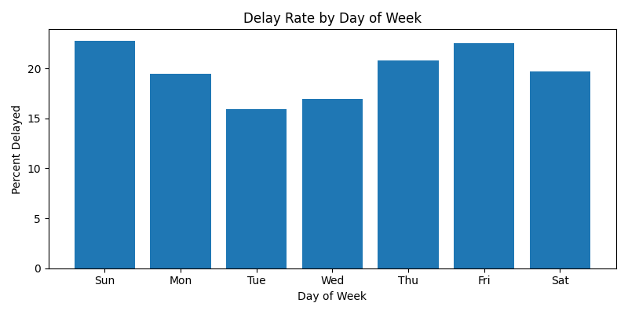
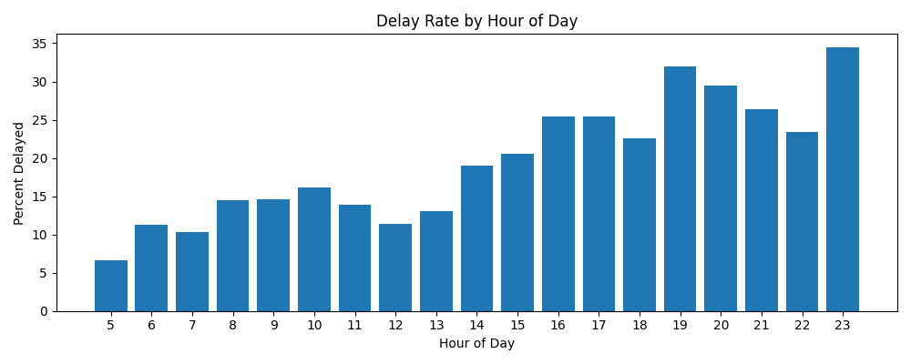

# Flight Delay Analysis - Atlanta Airport (ATL) 2023

Analysis of 5,000 flight departures to find delay patterns by day of week, hour of day, and passenger volume.

## Goal

- Track late departure rate using 15-minute threshold (FAA standard)
- Find which days and times have the most delays
- Compare delay patterns with passenger volume
- Understand patterns that could help with scheduling

## Data

- `flights.csv` - ATL outbound flights sample (5,000 records)
- `us-daily-passengers.csv` - TSA daily passenger counts

## Key Findings

### Overall
- Total flights: 5,000
- Overall late rate: **19.8%**

### By Day of Week

| Day | Late Rate |
|-----|-----------|
| Sunday | 22.8% (highest) |
| Friday | 22.5% |
| Thursday | 20.8% |
| Saturday | 19.7% |
| Monday | 19.4% |
| Wednesday | 16.9% |
| Tuesday | 15.9% (lowest) |

**Finding:** Sunday has ~44% more delays than Tuesday.

### By Hour of Day

| Time Period | Late Rate |
|-------------|-----------|
| Morning (5-12) | ~13.8% |
| Afternoon (12-17) | ~18.4% |
| Evening (17-21) | ~27.7% |
| Night (21+) | ~25.8% |

**Finding:** Evening flights are about 2x more likely to be delayed than morning flights. This is probably because delays build up during the day (cascade effect).

### Passenger Volume Comparison

Days with higher passenger volume (Sunday, Friday) tend to have higher delay rates. This makes sense - more passengers means fuller flights, busier airports, and tighter turnaround times.

## Business Implications

Why morning flights are better:
- Aircraft haven't had delays from earlier flights yet
- Less airport congestion
- Crews are fresh (no timeout issues)

Why Sunday is worst:
- Weekend travel is heavier
- Recovery from Saturday operations

**Recommendation:** If you want to minimize delays, fly on Tuesday morning.

## How to Run

1. Install pandas and matplotlib
2. Open `flights-delays-project.ipynb`
3. Run all cells

## Files

- `flights-delays-project.ipynb` - main analysis
- `flights.csv` - flight data
- `us-daily-passengers.csv` - passenger data
- `EXECUTIVE_SUMMARY.md` - one-page summary

## Context

Completed as part of Python Institute Data Analysis Associate certification.
